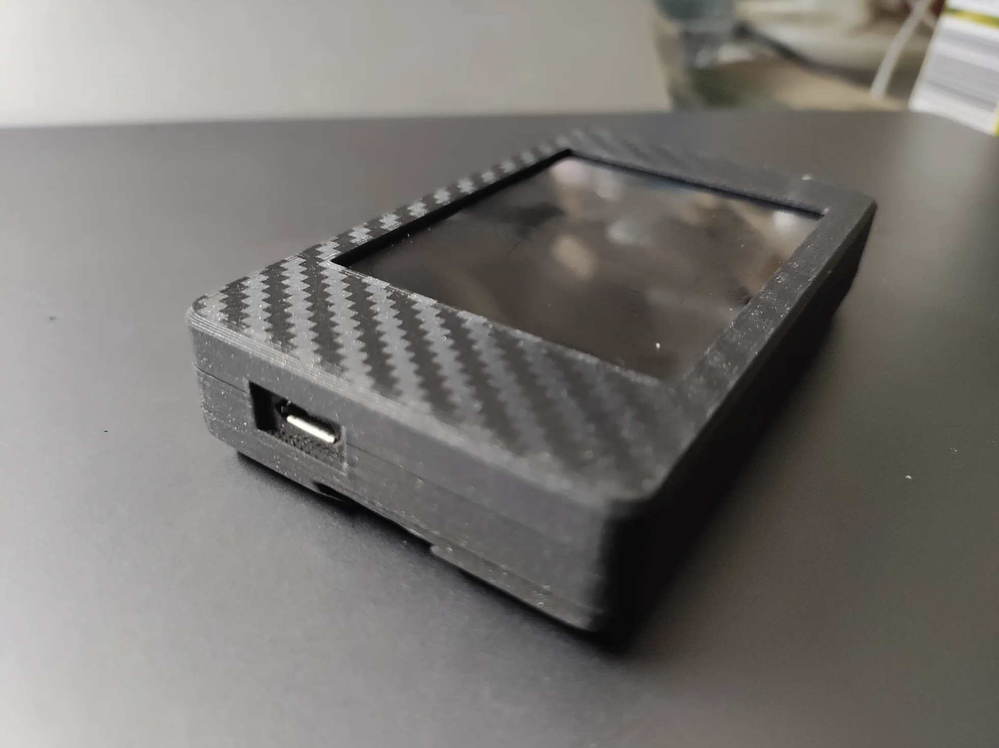
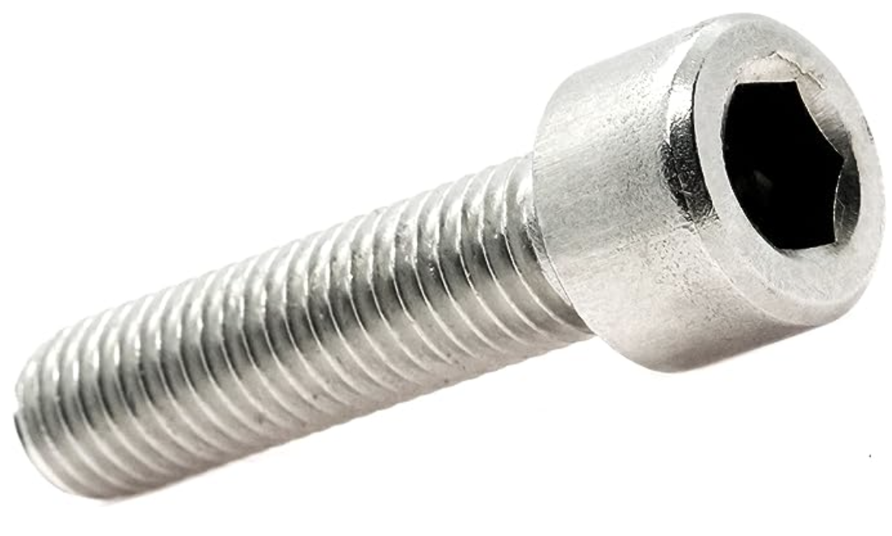

# Sunton ESP32-2432S028R Case

[![CC BY-NC-SA 4.0][cc-by-nc-sa-image]][cc-by-nc-sa]

## This is a case for the ESP32 based Sunton ESP32-2432S028R LCD+Controller

This is a remix of the really nice case by [@Dsk001](https://www.printables.com/@Dsk001). The original can be found here [Alien3D Deck](https://www.printables.com/model/310352-alien3d-deck)

### This remix has changed the following
- Changed to using inset M3x12 socket head screws
- Removed logo(s) (I needed a cleaner look)
- Cleaned up LED hole on the back plate
- Created two models, one with backplate mounting track and one without the track

This case is suitable for ESP32-2432S028R which can easily be found on amazon, ebay or aliexpress.  Below are some pictures to help you identify it.  

### Specifications
- 2.8" ESP32 Module ESP32-2432S028R
- WiFi+BT Dual-core 
- 240X320 Resistive LCD Touchscreen

Requires four M3x12 socket head screws.  These can easily be found on amazon or aliexpress and look like this:

## I printed using these settings:
- PLA
- 0.4mm nozzle
- adaptive layer height (using the default adaptive layer bambu studio settings)
- 2 layer wall
- no support
- 10% infill
- gyroid infill pattern
- no brim
- no supports
- no ironing

Requires 24g of filament

## Print orientation:

This work is licensed under a
[Creative Commons Attribution-NonCommercial-ShareAlike 4.0 International License][cc-by-nc-sa].

[![CC BY-NC-SA 4.0][cc-by-nc-sa-image]][cc-by-nc-sa]

[cc-by-nc-sa]: http://creativecommons.org/licenses/by-nc-sa/4.0/
[cc-by-nc-sa-image]: https://licensebuttons.net/l/by-nc-sa/4.0/88x31.png
[cc-by-nc-sa-shield]: https://img.shields.io/badge/License-CC%20BY--NC--SA%204.0-lightgrey.svg
